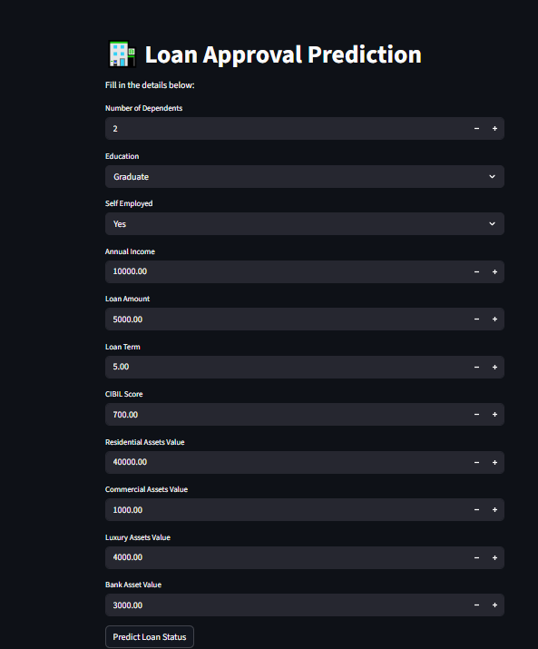
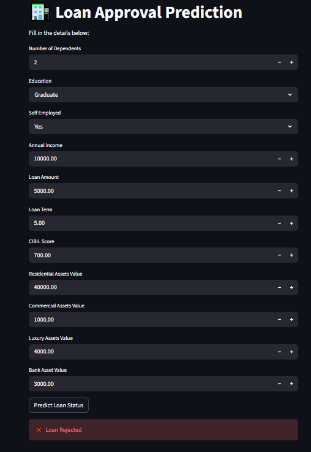

# 🏦 Loan Approval Prediction App

A Machine Learning web application built using **Streamlit** that predicts whether a loan application will be **Approved or Rejected** based on user inputs.

---

## 🚀 Demo

This app allows users to input financial and personal details and instantly get loan approval predictions.

---

## 📸 Screenshots

### 🔹 Input Page

### 🔹 Output Result (Rejected)

---

## 📊 Features

- User-friendly interface using Streamlit
- Real-time prediction
- Machine Learning model (Random Forest)
- Automatic data encoding and scaling
- Error handling included

---

## 🧠 Model Details

- Algorithm: **Random Forest Classifier**
- Preprocessing:
  - Label Encoding
  - Standard Scaling
- Dataset: Loan Approval Dataset

---

## 📥 Input Parameters

- Number of Dependents
- Education
- Self Employed
- Annual Income
- Loan Amount
- Loan Term
- CIBIL Score
- Residential Assets Value
- Commercial Assets Value
- Luxury Assets Value
- Bank Asset Value

---

## 📤 Output

- ✅ Loan Approved  
- ❌ Loan Rejected  

---

## 🗂️ Project Structure
